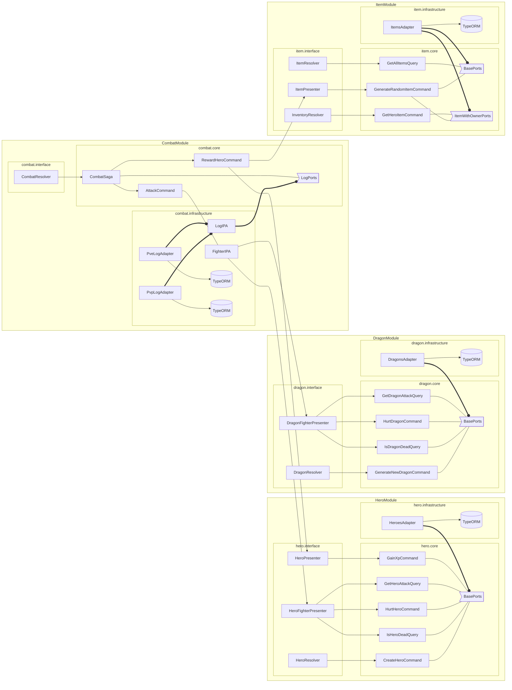

```mermaid
flowchart LR
    subgraph CombatModule
      subgraph combat.interface
      CombatResolver
      end

      CombatResolver --> CombatSaga

      subgraph combat.core
      CombatSaga --> AttackCommand
      CombatSaga --> RewardHeroCommand
      CombatSaga --- logPorts>LogPorts]
      end

      subgraph combat.infrastructure
      FighterIPA

      PveLogAdapter ==o LogIPA
      PvpLogAdapter ==o LogIPA

      PveLogAdapter --> PveLogRepository[(TypeORM)]
      PvpLogAdapter --> PvpLogRepository[(TypeORM)]
      end

      LogIPA ==o logPorts
      AttackCommand --- FighterIPA
    end

    subgraph HeroModule
      subgraph hero.interface
      HeroFighterPresenter
      HeroPresenter
      HeroResolver
      end

      HeroFighterPresenter --> GetHeroAttackQuery
      HeroFighterPresenter --> HurtHeroCommand
      HeroFighterPresenter --> IsHeroDeadQuery
      HeroPresenter --> GainXpCommand
      HeroResolver --> CreateHeroCommand

      subgraph hero.core
      heroPorts>"BasePorts<Hero>"]

      GainXpCommand --- heroPorts
      GetHeroAttackQuery --- heroPorts
      HurtHeroCommand --- heroPorts
      IsHeroDeadQuery --- heroPorts
      CreateHeroCommand --- heroPorts
      end

      HeroesAdapter ==o heroPorts

      subgraph hero.infrastructure
      HeroesAdapter --> HeroRepository[(TypeORM)]
      end
    end

    subgraph DragonModule
      subgraph dragon.interface
      DragonFighterPresenter
      DragonResolver
      end

      DragonResolver --> GenerateNewDragonCommand
      DragonFighterPresenter --> GetDragonAttackQuery
      DragonFighterPresenter --> HurtDragonCommand
      DragonFighterPresenter --> IsDragonDeadQuery

      subgraph dragon.core
      dragonPorts>"BasePorts<Dragon>"]

      GetDragonAttackQuery --- dragonPorts
      HurtDragonCommand --- dragonPorts
      IsDragonDeadQuery --- dragonPorts
      GenerateNewDragonCommand --- dragonPorts
      end

      DragonsAdapter ==o dragonPorts

      subgraph dragon.infrastructure
      DragonsAdapter --> DragonRepository[(TypeORM)]
      end
    end

    subgraph ItemModule
      subgraph item.interface
      ItemResolver
      InventoryResolver
      ItemPresenter
      end

      ItemPresenter --> GenerateRandomItemCommand
      ItemResolver --> GetAllItemsQuery
      InventoryResolver --> GetHeroItemCommand

      subgraph item.core
      itemPorts>"BasePorts<Item>"]
      itemWithOwnerPorts>"ItemWithOwnerPorts"]

      GetAllItemsQuery --- itemPorts
      GetHeroItemCommand --- itemWithOwnerPorts
      GenerateRandomItemCommand --- itemPorts
      GenerateRandomItemCommand --- itemWithOwnerPorts
      end

      ItemsAdapter ==o itemPorts
      ItemsAdapter ==o itemWithOwnerPorts

      subgraph item.infrastructure
      ItemsAdapter --> ItemRepository[(TypeORM)]
      end
    end

    FighterIPA --> HeroFighterPresenter
    FighterIPA --> DragonFighterPresenter

    RewardHeroCommand --> HeroPresenter
    RewardHeroCommand --> ItemPresenter
```
