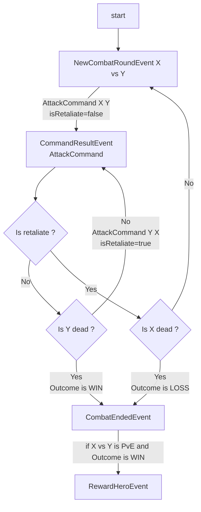

```mermaid
flowchart TD
  start --> A
  A[NewCombatRoundEvent X vs Y] -- AttackCommand X Y<br>isRetaliate=false --> B[CommandResultEvent<br>AttackCommand]
  B --> C{Is retaliate ?}
  C -->|No| E{Is Y dead ?}
  C -->|Yes| D{Is X dead ?}

  D -->|Yes<br>Outcome is LOSS| F[CombatEndedEvent]
  E -->|Yes<br>Outcome is WIN| F

  D -->|No| A
  E -->|No<br>AttackCommand Y X<br>isRetaliate=true| B

  F -- if X vs Y is PvE and Outcome is WIN --> G[RewardHeroEvent]
```
